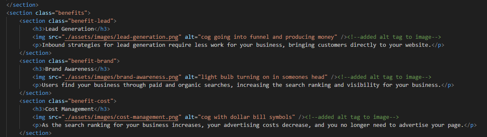
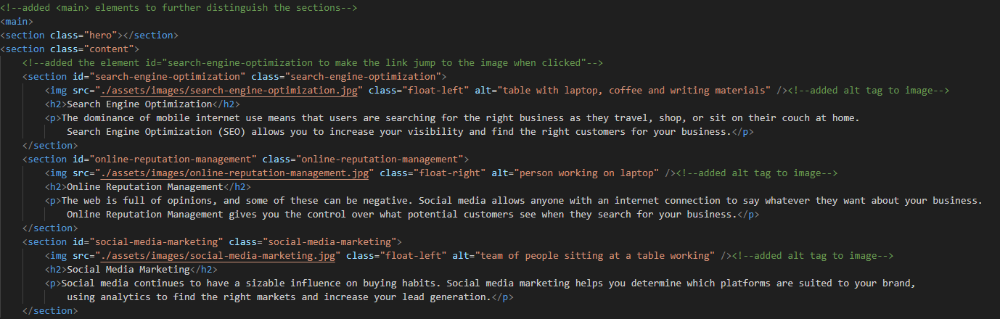

# Horiseon-Refactor

## Discription

I initiated work on this project to practice identifying and implimenting ways to make a webpage more accessible. In the process I learned more about the importance of semantic html elements, alt tags for images as well as functional navagation links in the header. When I first open this page up I noticed a few elements that needed to be changed. I updated the div elements to more specific elements such as header, nav, section, main body and footer. These elements are important for accessibilty because they make it easier for screen readers to interpret the page and they require less memory to on mobile devices which in turn makes the website run smoother and faster. I also added alt tags to the images so screen readers can interpret the image and fixed the "search engine optimzation" navigation link by adding and id element to its section. Finally, I condenced some of the css elements to reduce the overall number of lines.

## Screenshots

*Examples of the alt tags I added*
 
 
*Example of fixed link*

[Visit the Deployed Site](https://andrewchall92.github.io/horiseon-refactor/)

Technology Used         | Resource URL           | 
| ------------- |:-------------:| 
| HTML    | [https://developer.mozilla.org/en-US/docs/Web/HTML](https://developer.mozilla.org/en-US/docs/Web/HTML) | 
| CSS     | [https://developer.mozilla.org/en-US/docs/Web/CSS](https://developer.mozilla.org/en-US/docs/Web/CSS)      |   
| Git | [https://git-scm.com/](https://git-scm.com/)     |    

