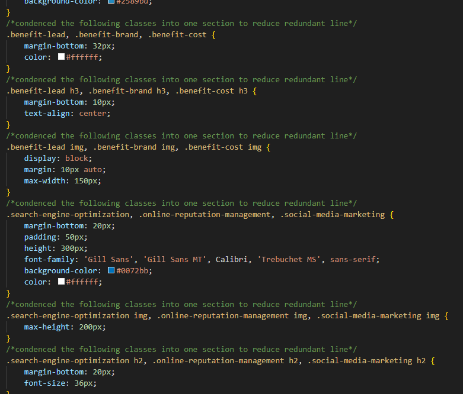

# Horiseon-Refactor

## Description

I initiated work on this project to practice identifying and implementing ways to make a webpage more accessible. In the process, I learned more about the importance of semantic HTML elements, alt tags for images, as well as functional navigation links in the header. When I first opened this page, I noticed a few elements that needed to be changed. I updated the div elements to more specific elements such as header, nav, section, main body, and footer. These elements are important for accessibility because they make it easier for screen readers to interpret the page, and they require less memory on mobile devices, which in turn makes the website run smoother and faster. I also added alt tags to the images so screen readers can interpret the image and fixed the "search engine optimization" navigation link by adding an id element to its section. Finally, I condensed some of the CSS elements to reduce the overall number of lines.

## Screenshots

I've attached 3 screenshots showcasing some of the html and css changes I made:

*Examples of the alt tags I added*
 

*Example of fixed link*

*Example of css changes*

[Visit the Deployed Site](https://andrewchall92.github.io/horiseon-refactor/)

Technology Used         | Resource URL           | 
| ------------- |:-------------:| 
| HTML    | [https://developer.mozilla.org/en-US/docs/Web/HTML](https://developer.mozilla.org/en-US/docs/Web/HTML) | 
| CSS     | [https://developer.mozilla.org/en-US/docs/Web/CSS](https://developer.mozilla.org/en-US/docs/Web/CSS)      |   
| Git | [https://git-scm.com/](https://git-scm.com/)     |    

## Features

- Easily accessible website containing information about how to present your company through your website and on social media.
- Navigation links in the header to easily and quickly navigate the page.
- Semantic html elements making the page easily readable by screen readers.

## Sources

- https://www.w3schools.com/html/html5_semantic_elements.asp
- https://www.codecademy.com/resources/blog/semantic-html/
- https://www.ada.gov/resources/web-guidance/

## License

This project is licensed under the [MIT License](LICENSE).

